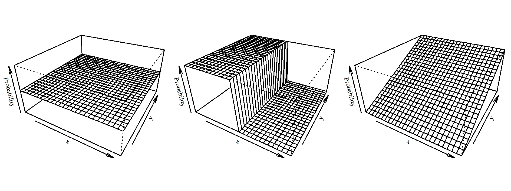

<!-- output: rmarkdown::pdf_document --> 
<!-- output: rmarkdown::html_document --> 

## Contents

<a href="#overview">**1. Overview**</a>

<a href="#intro">**2. Introduction to SECR**</a>  

<a href="#install">**3. Installing the software**</a>

<a href="#data">**4. Data import**</a>  

<a href="#mask">**5. Making a mask**</a>  

<a href="#model">**6. Model fitting**</a>  

<a href="#plots">**7. Plotting results**</a>

<a href="#selection">**8. Model selection**</a>

<a href="#menu">**9. Menu options**</a>

********************************************************************************

## 1. Overview

The `gibbonsecr` software package uses **Spatially Explicit Capture--Recapture (SECR)** methods to estimate the density of gibbon populations from acoustic survey data. This manual begins with a brief introduction to the theory behind SECR and then describes the main components of the software.

********************************************************************************

## 2. Introduction to SECR

<a href="#intro-setup">**2.1 Basic setup**</a>  

<a href="#intro-bearings">**2.2 Estimated bearings**</a>

<a href="#intro-detfunc">**2.3 Detection functions**</a>

<a href="#intro-detsurf">**2.4 Detection surface**</a>

<a href="#intro-esa">**2.5 Effective Sampling Area**</a>

<a href="#contents">(Back to contents)</a>

 
Over the past decade SECR has become an increasingly popular tool for wildlife population assessment and has been used to analyse survey data for a wide range of animal groups. The main advantage it has over traditional capure-recapture techniques is that it allows direct estmation of population **density** rather than abundance. Traditional capture-recapture methods can only provide density estimates through the use of separate estimates (or assumptions) about the size of the sampled area. In SECR however, density is estimated from the survey data by using information contained in the pattern of the recapture data (relative to the locations of the detectors) to make inferences about the spatial location of animals. By extracting spatial information in this way SECR can provide direct estimates of density without requiring the exact locations of the detected animals to be known in advance.

### 2.1 Basic setup

The basic data collection setup for an SECR analysis consists of a spatial array of **detectors**. Detectors come in a variety of different forms, including traps which physically detain the animals, and **proximity detectors** which do not. Using proximity detectors it is possible for an animal to be detected at more than one detector (i.e. recaptured) during a single sampling occasion.

The plot below shows a hypothetical array of proximity detectors, with red squares representing detections of the same animal (or the same group in the case of gibbons surveys) and black squares representing no detections.

 
  
 

The pattern of the detections (i.e. the pattern of the recapture data) gives us information about the true location of the animal/group; intutitively we would guess that it is probably near the cluster of red detectors. The plot below shows a set of probability contours for this unknown location, given the recapture data.

 
  
 

In the case of acoustic gibbon surveys the listening posts can be treated as proximity detectors and the same logic can be applied to infer the unknown locations of the detected groups. However, the design shown in the figure above would obviously be impractical for gibbon surveys. The next figure shows probability contours for a more reslistic array of listening posts where a group has been detected at two of the posts. 

 
  
 

<a href="#intro">(Back to top of section)</a>  
<a href="#contents">(Back to contents)</a>

### 2.2 Estimated bearings

As you probably guessed from the previous section, using fewer detectors results in less information on the unknown locations. Fortunately however, SECR also allows **supplementary information** on group location to be included in the analysis -- for example in the form of **estimated bearings** to the detected animals/groups. The next figure illustrates how taking account of information contained in the estimated bearings can provide better quality information on animal/group locations.

 
  
 

Using estimated bearings in this way can lead to density estimates that are less biased and more precise than using recapture data alone. Since the precision of bearing estimates is usually unknown, SECR methods estimate it from the data. This requires the choice of a **bearing error distribution**. The figure below shows two common choices of distribution for modelling bearing errors -- the **von Mises** and the **wrapped Cauchy** -- where the color of the lines indicates the value of the precision parameter (SECR estimates the value of this parameter from the survey data).

  
 

The wrapped Cauchy is likely to perform better when there are a small number of large errors but when most of the estimates are close to the truth. The von Mises is likely to perform better there are fewer large errors.

<a href="#intro">(Back to top of section)</a>  
<a href="#contents">(Back to contents)</a>

### 2.3 Detection functions

Another key feature of SECR is that the probability of detecting a (calling) gibbon group at a given location is modelled as a function of distance from the detector. This function -- referred to as the **detection function** -- is typically assumed to belong to one of two main types of function: the **half normal** or the **hazard rate**. The specific shape of the detection function depends on the value of its parameters, which need to be estimated from the survey data. The half normal has two parameters: `g0` and `sigma`. The `g0` parameter gives the probability at zero distance and the `sigma` parameter controls the width of the function. The hazard rate has three parameters: `g0`, `sigma` and `z`. The `z` parameter controls the shape of the 'shoulder' and adds a greater degree of flexibility. The figure below illustrates the shape of these detection functions for a range of parameter values.

  
 

<a href="#intro">(Back to top of section)</a>  
<a href="#contents">(Back to contents)</a>

### 2.4 Detection surface

The association of a detection function with each detector allows the overall probability of detection by at least one detector during the survey to be calculated for any given animal/group location. The figure below illustrates this idea of overall detection probability using a heatmap of a **detection surface**.

  

The region near the centre of the surface is close to the detector array and has the highest detection probability. E.g. in the figure above, an animal/group near to the detectors will almost certainly be detected. This probability declines as distance from the detectors increases.

<a href="#intro">(Back to top of section)</a>  
<a href="#contents">(Back to contents)</a>

### 2.5 Effective sampling area

The shape of the detection surface is related to the size of the **effective sampling area**. Since the region close to the detectors has a very high detection probability, most animals/groups within this region will be detected and this region will therefore be almost perfectly sampled. However, regions where the detection probability is less than 1 will not be compltely sampled as some animal/groups in these areas will be missed. The figure below illustrates this idea for a series of arbitrary detection surfaces.

The first plot in this figure shows a flat surface where the detection probability is 0.5 everywhere. In this scenario every animal/group has a 50% chance of being detected. If the area covered by the surface was 10km2, then the *effective* sampling area would be 10km2 x 0.5 = 5km2. Using this detection process we would expect to detect the same number of animals/groups as we would if we perfectly sampled an area of 5km2. In the second plot in the figure above half of the area is sampled perfectly and the other half is not sampled at all, so this has the same effective sampling area as the first plot. The third plot has a detection gradient and isn't as intuitive to interpret. However, the way we calculate the effective survey area is to calculate the volumn under the detection surface. The third plot has the same volume as the other two, so it has the same effective area.

 
<a href="#intro">(Back to top of section)</a>  
<a href="#contents">(Back to contents)</a>

********************************************************************************

## Installing the software

There are two ways to install the `gibbonsecr` software.
 
<a href="#install">(Back to top of section)</a>  
<a href="#contents">(Back to contents)</a>

********************************************************************************

## 4. Data import

<a href="#data-csv">**4.1 CSV files**</a>  
<a href="#data-csv-detections">-- 4.1.1 Detections</a>  
<a href="#data-csv-posts">     -- 4.1.2 Posts</a>  
<a href="#data-csv-covariates">-- 4.1.3 Covariates</a>  

<a href="#data-details">**4.2 Data details**</a>  

<a href="#contents">(Back to contents)</a>

### 4.1 CSV files

#### 4.1.1 Detections

#### 4.1.2 Posts

#### 4.1.3 Covariates

<a href="#data">(Back to top of section)</a>  
<a href="#contents">(Back to contents)</a>

### 4.2 Data details

 
<a href="#data">(Back to top of section)</a>  
<a href="#contents">(Back to contents)</a>

********************************************************************************

## 5. Making a mask

<a href="#mask-size">**5.1 Size and resolution**</a>  
<a href="#mask-size-buffer">-- 5.1.1 Buffer</a>  
<a href="#mask-size-spacing">-- 5.1.2 Spacing</a>  

<a href="#mask-shp">**5.2 SHP files**</a>  
<a href="#mask-shp-region">-- 5.2.1 Region</a>  
<a href="#mask-shp-habitat">-- 5.2.2 Habitat</a>  

<a href="#contents">(Back to contents)</a>

### 5.1 Size and resolution

#### 5.1.1 Buffer

#### 5.1.1 Spacing

<a href="#mask">(Back to top of section)</a>  
<a href="#contents">(Back to contents)</a>

### 5.2 SHP files

#### 5.2.1 Region

#### 5.2.2 Habitat

 
<a href="#mask">(Back to top of section)</a>  
<a href="#contents">(Back to contents)</a>

********************************************************************************

## 6. Model fitting

<a href="#model-options">**6.1 Model options**</a>  
<a href="#model-options-detfunc">-- 6.1.1 Detection function</a>  
<a href="#model-options-bearings">-- 6.1.2 Bearings distribution</a>  
<a href="#model-options-distances">-- 6.1.3 Distancses distribution</a>

<a href="#model-submodels">**6.2 Sub-models**</a>  
<a href="#model-submodels-formulas">-- 6.2.1 Formulas</a>  
<a href="#model-submodels-fixed">-- 6.2.1 Fixing parameter values</a>  

<a href="#contents">(Back to contents)</a>

### 6.1 Model options

#### 6.1.1 Detection function

<a href="#model">(Back to top of section)</a>  
<a href="#contents">(Back to contents)</a>

#### 6.1.2 Bearings distribution

<a href="#model">(Back to top of section)</a>  
<a href="#contents">(Back to contents)</a>

#### 6.1.3 Distances distribution

<a href="#model">(Back to top of section)</a>  
<a href="#contents">(Back to contents)</a>

### 6.2 Sub-models

<a href="#model">(Back to top of section)</a>  
<a href="#contents">(Back to contents)</a>

#### 6.2.1 Formulas

<a href="#model">(Back to top of section)</a>  
<a href="#contents">(Back to contents)</a>

#### 6.2.2 Fixing parameter values

 
<a href="#model">(Back to top of section)</a>  
<a href="#contents">(Back to contents)</a>

********************************************************************************

## 7. Plotting results

 
<a href="#plots">(Back to top of section)</a>  
<a href="#contents">(Back to contents)</a>

********************************************************************************

## 8. Model selection

 
<a href="#selection">(Back to top of section)</a>  
<a href="#contents">(Back to contents)</a>

********************************************************************************

## 9. Menu Options

 
<a href="#menu">(Back to top of section)</a>  
<a href="#contents">(Back to contents)</a>

********************************************************************************

