<!-- 
title: 'gibbonsecr: GUI User Manual'
author: "Darren Kidney"
date: '`r Sys.Date()`'
output: rmarkdown::html_vignette
vignette: >
 %\VignetteIndexEntry{GUI User Manual}
 %\VignetteEngine{knitr::rmarkdown}
 %\VignetteEncoding{UTF-8} 
--> 

<!-- 
title: 'gibbonsecr: GUI User Manual'
output: pdf_document
--> 

<!-- 
output: rmarkdown::html_document 
--> 


<a name="contents"></a>

## Contents

<a href="#overview"> **1. Overview**</a>

<a href="#intro">    **2. Introduction to SECR**</a>  

<a href="#load">     **3. Loading the software**</a>

<a href="#data">     **4. Data import**</a>  

<a href="#mask">     **5. Making a mask**</a>  

<a href="#model">    **6. Model fitting**</a>  

<a href="#plots">    **7. Plotting results**</a>

<a href="#selection">**8. Model selection**</a>

<a href="#menu">     **9. Menu options**</a>

<a href="#bugs">     **10. Reporting bugs**</a>


********************************************************************************

<a name="overview"></a>

## 1. Overview

The `gibbonsecr` software package uses **Spatially Explicit Capture--Recapture (SECR)** methods to estimate the density of gibbon populations from acoustic survey data. This manual begins with a brief introduction to the theory behind SECR and then describes the main components of the software.


********************************************************************************

<a name="intro"></a>

## 2. Introduction to SECR

<a href="#intro-setup">    **2.1 Basic setup**</a>  

<a href="#intro-bearings"> **2.2 Estimated bearings**</a>

<a href="#intro-distances">**2.3 Estimated distances**</a>

<a href="#intro-detfunc">  **2.4 Detection functions**</a>

<a href="#intro-detsurf">  **2.5 Detection surface**</a>

<a href="#intro-esa">      **2.6 Effective Sampling Area**</a>

<a href="#contents">(Back to contents)</a>

<br/>
Over the past decade SECR has become an increasingly popular tool for wildlife population assessment and has been used to analyse survey data for a wide range of animal groups. The main advantage it has over traditional capture-recapture techniques is that it allows direct estimation of population **density** rather than abundance. Traditional capture-recapture methods can only provide density estimates through the use of separate estimates (or assumptions) about the size of the sampled area. In SECR however, density is estimated from the survey data by using information contained in the pattern of the recapture data (relative to the locations of the detectors) to make inferences about the spatial location of animals. By extracting spatial information in this way SECR can provide direct estimates of density without requiring the exact locations of the detected animals to be known in advance.

<a name="intro-setup"></a>

### 2.1 Basic setup

The basic data collection setup for an SECR analysis consists of a spatial array of **detectors**. Detectors come in a variety of different forms, including traps which physically detain the animals, and **proximity detectors** which do not. Using proximity detectors it is possible for an animal to be detected at more than one detector (i.e. recaptured) during a single sampling occasion.

The plot below shows a hypothetical array of proximity detectors, with red squares representing detections of the same animal (or the same group in the case of gibbon surveys) and black squares representing no detections.

<br/>
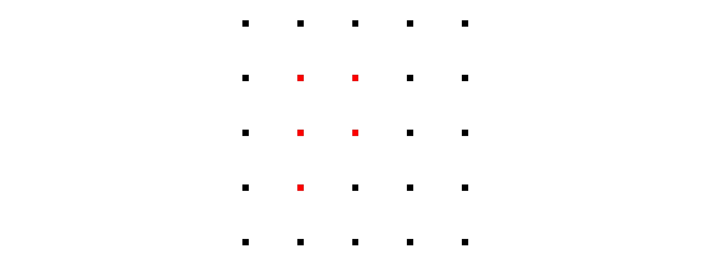  
<br/>

The pattern of the detections (i.e. the pattern of the recapture data) gives us information about the true location of the animal/group; intuitively we would guess that it is probably near the cluster of red detectors. The plot below shows a set of probability contours for this unknown location, given the recapture data.

<br/>
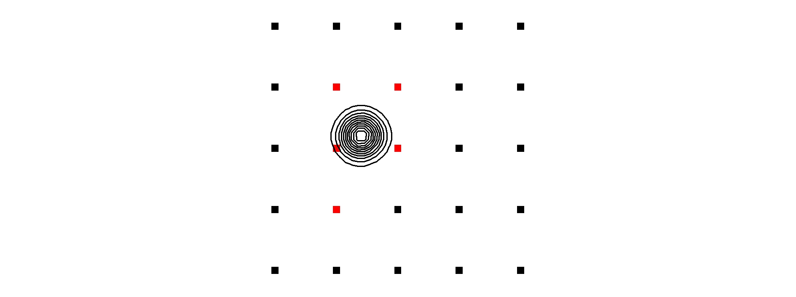  
<br/>

In the case of acoustic gibbon surveys the listening posts can be treated as proximity detectors and the same logic can be applied to infer the unknown locations of the detected groups. However, the design shown in the figure above would obviously be impractical for gibbon surveys. The next figure shows probability contours for a more realistic array of listening posts where a group has been detected at two of the posts. 

<br/>
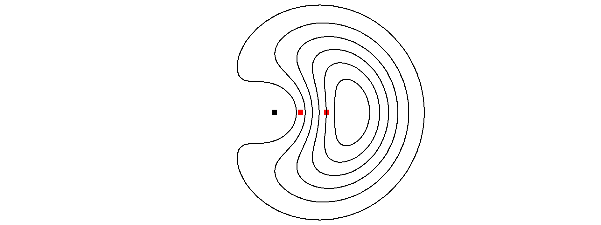  
<br/>

<a href="#intro">(Back to top of section)</a>  
<a href="#contents">(Back to contents)</a>

<a name="intro-bearings"></a>

### 2.2 Estimated bearings

As you probably guessed from the previous section, using fewer detectors results in less information on the unknown locations. Fortunately however, SECR also allows **supplementary information** on group location to be included in the analysis -- for example in the form of **estimated bearings** to the detected animals/groups. The next figure illustrates how taking account of information contained in the estimated bearings can provide better quality information on animal/group locations.

<br/>
  
<br/>

Using estimated bearings in this way can lead to density estimates that are less biased and more precise than using recapture data alone. Since the precision of bearing estimates is usually unknown, SECR methods estimate it from the data. This requires the choice of a **bearing error distribution**. The figure below shows two common choices of distribution for modelling bearing errors -- the **von Mises** and the **wrapped Cauchy** -- where the colour of the lines indicates the value of the precision parameter (SECR estimates the value of this parameter from the survey data).

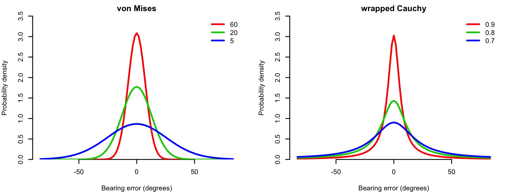  
<br/>

The wrapped Cauchy is likely to perform better when there are a small number of large errors but when most of the estimates are close to the truth. The von Mises is likely to perform better there are fewer large errors.

<a href="#intro">(Back to top of section)</a>  
<a href="#contents">(Back to contents)</a>

<a name="intro-distances"></a>

### 2.3 Estimated distances

TODO

<a href="#intro">(Back to top of section)</a>  
<a href="#contents">(Back to contents)</a>

<a name="intro-detfunc"></a>

### 2.4 Detection functions

Another key feature of SECR is that the probability of detecting a (calling) gibbon group at a given location is modelled as a function of distance from the detector. This function -- referred to as the **detection function** -- is typically assumed to belong to one of two main types of function: the **half normal** or the **hazard rate**. The specific shape of the detection function depends on the value of its parameters, which need to be estimated from the survey data. The half normal has two parameters: `g0` and `sigma`. The `g0` parameter gives the probability at zero distance and the `sigma` parameter controls the width of the function. The hazard rate has three parameters: `g0`, `sigma` and `z`. The `z` parameter controls the shape of the 'shoulder' and adds a greater degree of flexibility. The figure below illustrates the shape of these detection functions for a range of parameter values.

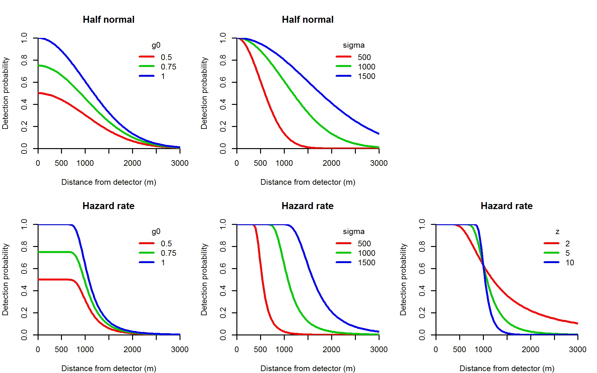  
<br/>

<a href="#intro">(Back to top of section)</a>  
<a href="#contents">(Back to contents)</a>

<a name="intro-detsurf"></a>

### 2.5 Detection surface

The association of a detection function with each detector allows the overall probability of detection by at least one detector during the survey to be calculated for any given animal/group location. The figure below illustrates this idea of overall detection probability using a heat map of a **detection surface**.

  

The region near the centre of the surface is close to the detector array and has the highest detection probability. E.g. in the figure above, an animal/group near to the detectors will almost certainly be detected. This probability declines as distance from the detectors increases.

<a href="#intro">(Back to top of section)</a>  
<a href="#contents">(Back to contents)</a>

<a name="intro-esa"></a>

### 2.6 Effective sampling area

The shape of the detection surface is related to the size of the **effective sampling area**. Since the region close to the detectors has a very high detection probability, most animals/groups within this region will be detected and this region will therefore be almost perfectly sampled. However, regions where the detection probability is less than 1 will not be completely sampled as some animal/groups in these areas will be missed. The figure below illustrates this idea for a series of arbitrary detection surfaces.

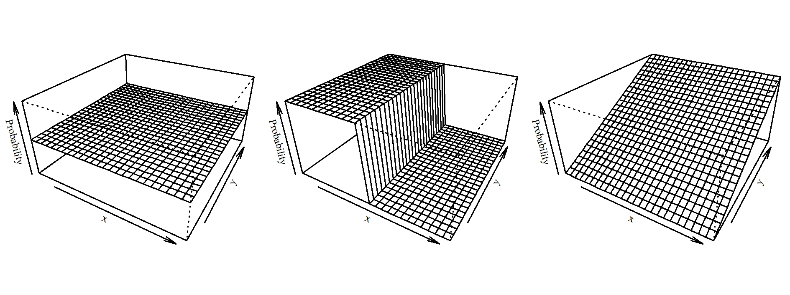

The first plot in this figure shows a flat surface where the detection probability is 0.5 everywhere. In this scenario every animal/group has a 50% chance of being detected. If the area covered by the surface was 10km^2^, then the *effective* sampling area would be 10km^2^ x 0.5 = 5km^2^. Using this detection process we would expect to detect the same number of animals/groups as we would if we perfectly sampled an area of 5km^2^. In the second plot in the figure above half of the area is sampled perfectly and the other half is not sampled at all, so this has the same effective sampling area as the first plot. The third plot has a detection gradient and isn't as intuitive to interpret. However, the way we calculate the effective survey area is to calculate the volume under the detection surface. The third plot has the same volume as the other two, so it has the same effective area.

<br/>
<a href="#intro">(Back to top of section)</a>  
<a href="#contents">(Back to contents)</a>


********************************************************************************

<a name="load"></a>

## 3. Loading the software

<a href="#load-r">**3.1 Launch from R**</a>  
<a href="#load-r-install">     --- 3.1.1 Install R</a>  
<a href="#load-r-dependencies">--- 3.1.2 Install prerequisite R packages</a>  
<a href="#load-r-gibbonsecr">  --- 3.1.3 Install the gibbonsecr package</a>  
<a href="#load-r-gui">         --- 3.1.4 Launch the user interface</a>  

<a href="#load-icon">**3.2 Launch from a desktop icon**</a>  
<a href="#load-icon-download"> --- 3.2.1 Download the files</a>  
<a href="#load-icon-shortcut"> --- 3.2.2 Make a shortcut icon</a>  

<a href="#contents">(Back to contents)</a>

<br/>
There are currently two ways to install the `gibbonsecr` software: (i) by installing a statistical software package called **R** from which you can launch the user interface; or (ii) by downloading a pre-compiled version of R and adding a shortcut icon for the user interface to the desktop.

**Note to Mac users:** Before you begin the installation process you need make sure you have the **XQuartz** software (also known as X11) on your machine. Users of OS X 10.5 (Leopard), 10.6 (Snow Leopard) and 10.7 (Lion) should already have this installed by default (to check, look for the `X11.app` application in your applications folder). Users of OS X 10.8 (Mountain Lion), 10.9 (Mavericks) and 10.10 (Yosemite) will need to install it manually.

[Download XQuartz](http://xquartz.macosforge.org/landing/)

<a name="load-r"></a>

### 3.1 Launch from R

<a name="load-r-install"></a>

#### 3.1.1 Install R

Make sure you have the latest version of **R** installed. 

[Download R for Windows](https://cran.r-project.org/bin/windows/base/)

[Download R for Mac](https://cran.r-project.org/bin/macosx/)

Optionally you can also install something called **RStudio** which acts as an interface to R and is more user-friendly (it has syntax highlighting and auto-completion for example). 

[Download RStudio](https://www.rstudio.com/products/rstudio/download/)

<a name="load-r-depedendencies"></a>

#### 3.1.2 Install prerequisite R packages

The `gibbonsecr` package uses some other R packages that don't come with the default version of R, so you'll need to install them manually by typing (or cutting and pasting) the code below into the R console.

```{r eval=FALSE}
install.packages(c("CircStats", "fields", "MASS", "nlme", "secr", "tcltk2"),
                 dependencies = TRUE)
```

<a name="load-r-gibbonsecr"></a>

#### 3.1.3 Install the gibbonsecr package

Once the prequisite packages are installed you can install the `gibbonsecr` package. It's currently hosted on [GitHub](https://github.com) but you can download it and install it by running the code below.

**Windows users:**
```{r eval=FALSE}
install.packages("https://github.com/dkidney/gibbonsecr/raw/master/binaries/gibbonsecr_1.0.zip", 
                 repos = NULL, type = "win.binary")
```

**Mac users:**
```{r eval=FALSE}
install.packages("devtools", dependencies = TRUE)
devtools::install_url("https://github.com/dkidney/gibbonsecr/raw/master/binaries/gibbonsecr_1.0.tgz")
```

<a name="load-r-gui"></a>

#### 3.1.4 Launch the user interface

You only need to run the above steps once. Once everything is installed you can launch the user interface by opening R (or RStudio) and typing the following lines into the console.

```{r eval=FALSE}
library(gibbonsecr)
gibbonsecr_gui()
```

<a href="#load">(Back to top of section)</a>  
<a href="#contents">(Back to contents)</a>

<a name="load-icon"></a>

### 3.2 Launch from a desktop icon

<a name="load-icon-download"></a>

#### 3.2.1 Download the files

TODO

<a name="load-icon-shortcut"></a>

#### 3.2.2 Make a shortcut icon

TODO

<br/>
<a href="#install">(Back to top of section)</a>  
<a href="#contents">(Back to contents)</a>


********************************************************************************

<a name="data"></a>

## 4. Data import

<a href="#data-csv">**4.1 CSV files**</a>  
<a href="#data-csv-detections">--- 4.1.1 Detections</a>  
<a href="#data-csv-posts">     --- 4.1.2 Posts</a>  
<a href="#data-csv-covariates">--- 4.1.3 Covariates</a>  

<a href="#data-details">**4.2 Data details**</a>

<a href="#data-buttons">**4.3 Data buttons**</a>

<a href="#contents">(Back to contents)</a>

<br/>
The first step in conducting an analysis is to import your survey data.
This is done via the *Data* tab.

`**SCREENSHOT**`

<a name="data-csv"></a>

### 4.1 CSV files

As a minimum you need to prepare a **detections** file and a **posts** file. You can also include an optional **covariates** file. Advice on how to structure these files is given in the sections below. All raw data files need to be in `.csv` format. The file paths to your data files can be entered manually into the text entry boxes in the *CSV files* section, or you can navigate to the file path using the `...` button.

<a name="data-csv-detections"></a>

#### 4.1.1 Detections

The detections file contains a record of each detection, with one row per detection. For example, if group 1 was recorded at listening posts A and B then this would count as 2 detections. This file needs to have the following columns:

* **array**    -- ID for the array
* **occasion** -- ID for day of the survey (typically an integer between 1 and 4)
* **post**     -- ID for the listening post
* **group**    -- ID for the group
* **bearing**  -- Estimated bearing

The screenshot below shows an example detections file for a one-day (i.e. single-occasion) survey.

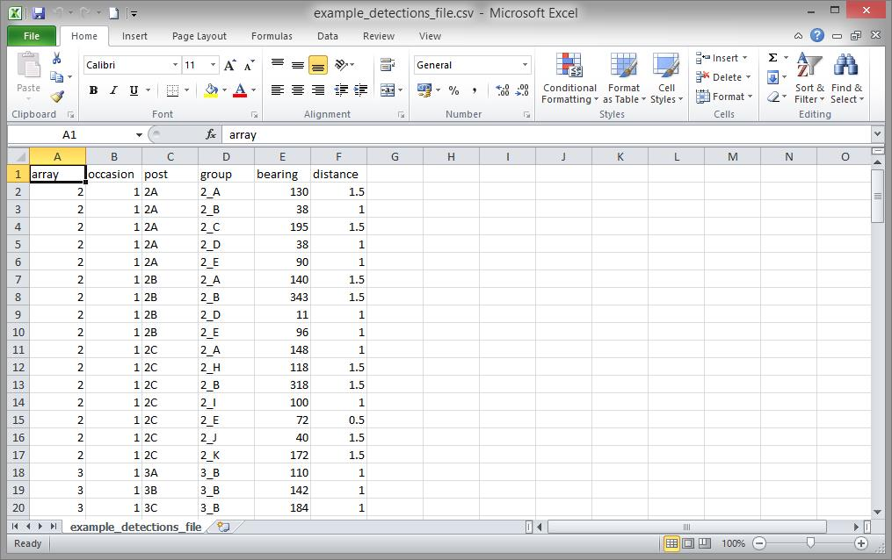

<a href="#data">(Back to top of section)</a>  
<a href="#contents">(Back to contents)</a>

<a name="data-csv-posts"></a>

#### 4.1.2 Posts

The posts file contains information on the location and usage of the listening posts. This file
needs to have one row per listening post and should contain the following columns:

* **array** -- ID for the array
* **post**  -- ID for the listening post
* **x**     -- Longitude coordinate (in metric units)
* **y**     -- Latitude coordinate (in metric units)
* **usage** -- Indicator showing the sampling days on which the posts were operated. E.g. if on a 3-day survey a particular post was used on day 1 and day 3 but for some reason not on day 2, you would write `101` in the usage column for that row. Each row in the usage column should contain the same number of digits.

The screenshot below shows an example posts file for a one-day survey.

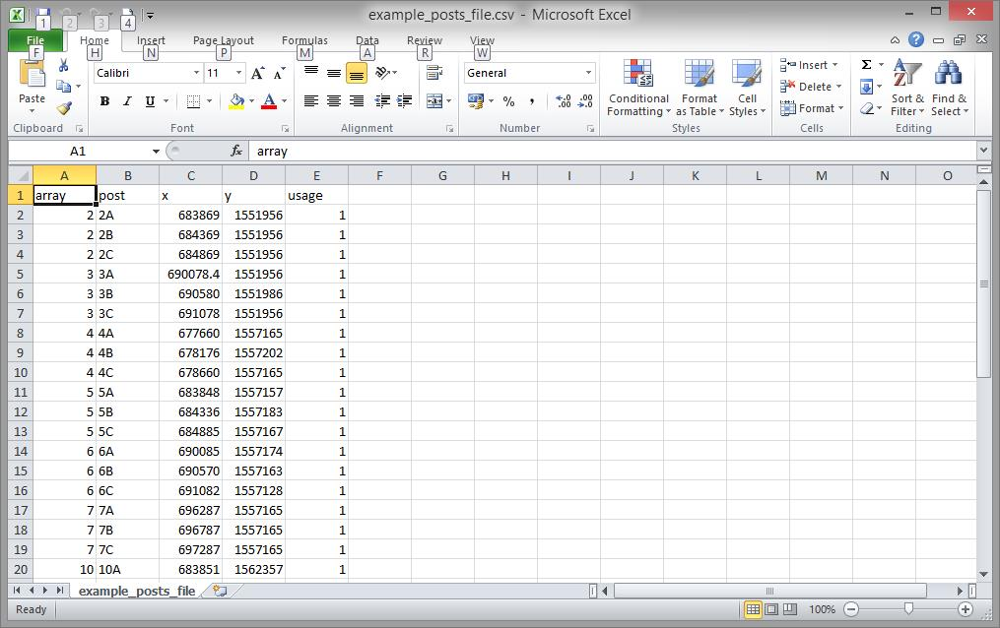

<a href="#data">(Back to top of section)</a>  
<a href="#contents">(Back to contents)</a>

<a name="data-csv-covariates"></a>

#### 4.1.3 Covariates

The covariates file contains information on environmental and other variables associated with the survey data. This file needs to have one row per day for each listening post and should contain the following columns:

* **array**    -- ID for the array
* **post**     -- ID for the listening post
* **occasion** -- ID for day of the survey (typically an integer between 1 and 4)

These columns can all be used as covariates themselves, but any additional covariates should be added using additional columns. Use underscores `_` instead of full stops for the covariate names.

The screenshot below shows an example covariates file for a one-day survey.

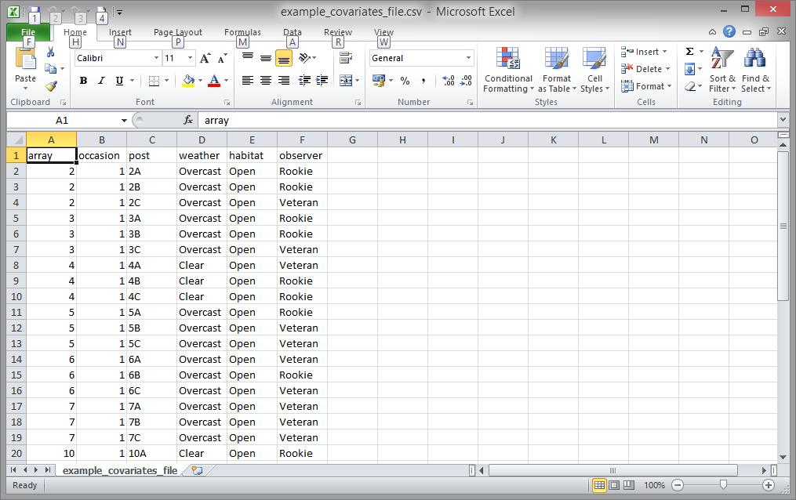

<a href="#data">(Back to top of section)</a>  
<a href="#contents">(Back to contents)</a>

<a name="data-details"></a>

### 4.2 Data details

Once the paths to the data files have been entered, select the relevant units from the *Data details* dropdown boxes for your estimated bearings data (and estimated distances data if it was collected). (Note that the current version of the software only allows `Type = continuous` since interval methods for bearings and distances haven't yet been implemented.)

<a href="#data">(Back to top of section)</a>  
<a href="#contents">(Back to contents)</a>

<a name="data-buttons"></a>

### 4.3 Data buttons

Once the paths to your data files have been added and the data details checked, you can then press the `Import` button. If your data imports successfully then a summary print out should appear in the output window. You can re-print this summary at any time by pressing the `Summary` button.

The screenshot below shows an example of some summary output after a successful data import.

`**SCREENSHOT**`

<br/>
<a href="#data">(Back to top of section)</a>  
<a href="#contents">(Back to contents)</a>


********************************************************************************

<a name="mask"></a>

## 5. Making a mask

<a href="#mask-size">**5.1 Mask size and resolution**</a>  
<a href="#mask-size-buffer"> --- 5.1.1 Buffer</a>  
<a href="#mask-size-spacing">--- 5.1.2 Spacing</a>  

<a href="#mask-shp">**5.2 SHP files**</a>  
<a href="#mask-shp-region">  --- 5.2.1 Region</a>  
<a href="#mask-shp-habitat"> --- 5.2.2 Habitat</a>  

<a href="#mask-buttons">**5.3 Mask buttons**</a>  

<a href="#contents">(Back to contents)</a>

The SECR model fitting procedure requires the use of a **mask** which is a fine grid of latitude and longitude coordinates around each array of listening posts. When an SECR model is fitted, the mask is used to provide a set of candidate locations for each detected group. It is important to use a suitable mask to avoid unreliable results.

<a name="mask-size"></a>

### 5.1 Mask size and resolution

There are two main settings you need to consider when defining a mask -- the **buffer** and the **spacing** -- which you can specify in the *Mask* tab. 

<a name="mask-size-buffer"></a>

#### 5.1.1 Buffer

The buffer defines the maximum distance between the mask points and the listening posts. It needs to be large enough so that the region it encompasses contains all plausible locations for the detected groups, but it shouldn't be unnecessarily large. Buffer distances that are too small will lead to underestimates of the effective sampling area and overestimates of density. However, increasing the buffer distance also increases the number of mask points, which means that the models will take longer to run, so the buffer also shouldn't be larger than it needs to be. **The ideal buffer distance is the distance at which the overall detection probability drops to zero**. 

A good way to check whether the buffer distance is large enough is to look at the detection surface, which you can plot after fitting a model (see the section on plotting results). The detection surface plot produced by `gibbonsecr` is the same size as the mask, so the colour at the edge of the plot will show you the overall detection probability at the buffer distance. If the detection probability is greater than zero at the buffer distance then you should increase the buffer distance, re-fit the model and re-check the detection surface plot. 

To illustrate this issue, the figure below shows a series of detection surfaces from models that were fitted using mask buffers of 1000m, 10000m and 5000m respectively.

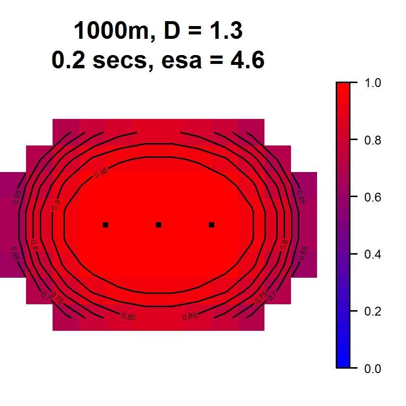
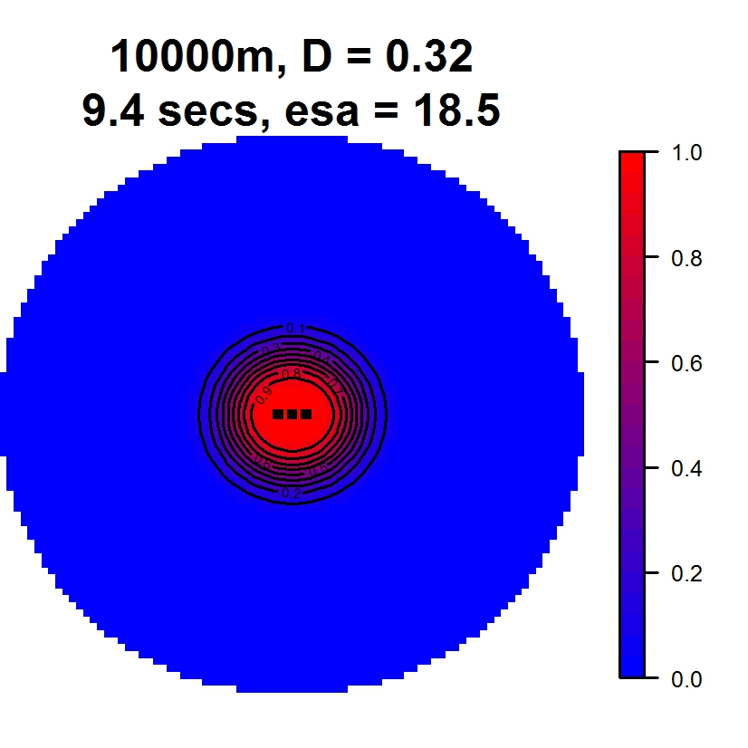


The buffer plot 1 looks to be too small, since the detection probability at the buffer distance is much greater than zero. In this case it is extremely likely that the true locations of some of the detected groups were actually outside the buffer zone. In plot 2 the buffer has been increased to 10000m. The detection probability at the buffer distance looks to be at zero so we would expect the density estimate to be unbiased. The density estimate in plot 2 is about 75% lower than the estimate in plot 1, which suggests that the estimate in plot 1 is a big overestimate. The buffer distance plot 3 is intermediate between the other two. The detection probability is still zero at the buffer distance, but the estimated density is very similar to plot 2, so it doesn't look to be biased. In this case the mask in plot 3 would be preferred since (for a given resolution) it will be much quicker to fit models than the mask in plot 2 whilst still giving reliable results.

<a href="#mask">(Back to top of section)</a>  
<a href="#contents">(Back to contents)</a>

<a name="mask-size-spacing"></a>

#### 5.1.2 Spacing

The buffer spacing is the distance between adjacent mask points. Decreasing the spacing will therefore increase the resolution and increase the total number of mask points. Smaller spacings provide a greater number of candidate locations and lead to more reliable results. However, increasing the number of mask points has a cost in terms of computing time and if the spacing is too small then models may take a very long time to run. As a general rule of thumb, try to use the smallest spacing that is practical given the speed of your computer, but try not to use spacings larger than 250m.

<a href="#mask">(Back to top of section)</a>  
<a href="#contents">(Back to contents)</a>

<a name="mask-shp"></a>

### 5.2 SHP files

The *Mask* tab also allows you to upload shapefiles in order to attach spatial covariate values to each of the mask points for use in model formulas.

**NB: Make sure the projection units in your .shp files are compatible with the coordinate system used in your *posts* data file**

<a name="mask-shp-region"></a>

#### 5.2.1 Region

TODO

<a name="mask-shp-habitat"></a>

#### 5.2.2 Habitat

TODO

<a href="#mask">(Back to top of section)</a>  
<a href="#contents">(Back to contents)</a>

<a name="mask-buttons"></a>

### 5.4 Mask buttons

TODO

<br/>
<a href="#mask">(Back to top of section)</a>  
<a href="#contents">(Back to contents)</a>


********************************************************************************

<a name="model"></a>

## 6. Model fitting

<a href="#model-options">**6.1 Model options**</a>  

<a href="#model-submodels">**6.2 Model parameters**</a>  
<a href="#model-submodels-formulas">--- 6.2.1 Formulas</a>  
<a href="#model-submodels-fixed">   --- 6.2.2 Fixing parameter values</a>  
<a href="#model-submodels-g0">      --- 6.2.3 Estimating g0</a>  
<a href="#model-submodels-pcall">   --- 6.2.4 Estimating calling probability</a>  

<a href="#model-buttons">**6.3 Model buttons**</a>  

<a href="#contents">(Back to contents)</a>

<br>
Once you have made a mask you can move on the *Model* tab and start fitting some SECR models.

`**SCREENSHOT**`

Specifying a model is split into two steps: (i) choosing what kind of detection function and bearing error distribution you want to use, and (ii) deciding whether to fix any parameter values or model them using the available covariates. These steps are described in more detail below.

<a name="model-options"></a>

### 6.1 Model options

The first section in the *Model* tab contains dropdown boxes where you can choose between different detection functions and different distributions for the estimated bearings and distances. 

* **Detection function** -- choose either the half normal (the default) or the hazard rate
* **Bearings distrbution** -- choose from the von Mises (the default), the wrapped Cauchy, or none
* **Distances distribution** -- choose from the gamma (the default), the log-normal, or none

Setting the bearings/distances distribution to `none` means that the bearings/distances data will be ignored in the analysis. Setting both bearings and distances distributions to `none` will result in a conventional SECR model being fitted using only the recapture data. 

<a href="#model">(Back to top of section)</a>  
<a href="#contents">(Back to contents)</a>

<a name="model-submodels"></a>

### 6.2 Model parameters

The next section in the *Model* tab provides various options for refining your model. Each row in this section relates to a particular parameter in the SECR model.

* **`D`** -- The number of groups per square kilometre
* **`g0`** -- The detection function intercept parameter (see <a href="#intro-detfunc">Section 2.4 </a>)
* **`sigma`** -- The detection function scale parameter (see <a href="#intro-detfunc">Section 2.4 </a>)
* **`bearings`** -- The parameter of the distribution for the bearing errors (see <a href="#intro-bearings">Section 2.2 </a>)
* **`distances`** -- The parameter of the distribution for the estimated distances (see <a href="#intro-distances">Section 2.3 </a>)
* **`pcall`** -- The probability of a group calling on a given day

Don't worry if you forget these definitions, hovering your cursor over the row labels on the user interface will open a temporary help box to give you a reminder.

<a href="#model">(Back to top of section)</a>  
<a href="#contents">(Back to contents)</a>

<a name="model-submodels-formulas"></a>

#### 6.2.1 Formulas

If you wish to estimate a particular parameter in your analysis then you need to make sure that the *Formula* entry box for that parameter is activated by clicking on the radio button on the right hand side of box. If the Formula box is activated but left blank then a single coefficient for that parameter will be estimated (i.e. an intercept-only model). If you wish to specify a formula for a particular parameter you need to click the radio button on the right hand side of the *Formula* entry box for that parameter using the available covariates then you need to type the names of the covariates you wish to use into the Formula box, separated by `+` signs. E.g. to model the `sigma` parameter using habitat and weather then you would type,

```
habitat + weather
```

into the Formula box for `sigma`. 

**A note to experienced R-users:** As well as `+` you can also the `*` and `:` operators to specify formulas. You can also use gam functions `s`, `te`, `ti` and `t2` (from the `mgcv` package) for numeric variables. However, the use of `as.factor` and `as.numeric` to coerce variables, and `-1` to change the model contrasts, is not supported. 

<a href="#model">(Back to top of section)</a>  
<a href="#contents">(Back to contents)</a>

<a name="model-submodels-fixed"></a>

#### 6.2.2 Fixing parameter values

Sometimes you many not want or need to estimate a particular parameter, in which case you can fix its value. To do this, click on the radio button on the right hand side of the *Fixed* entry box and type the value of the parameter in the box.

A general point to bear in mind when fixing any parameter is that it will generally lead to a more precise density estimate (i.e. one with narrower confidence intervals). If the fixed parameter is known with a high degree of certainty then this would be a desirable effect. However, if there is uncertainty over the true value of that parameter (e.g. you may have used an estimate from a previous study) then this will not be incorporated into the SECR results and the precision of the density estimate will be overestimated (i.e. the confidence intervals generated by the software will be too narrow).

<a href="#model">(Back to top of section)</a>  
<a href="#contents">(Back to contents)</a>

<a name="model-submodels-g0"></a>

#### 6.2.3 Estimating g0

For one-day surveys the only option allowed by the software is to fix `g0` at 1. This is because when the listening post is zero distance from a calling group the probability of detecting it is extraordinarily unlikely to be anything other than 1. (Remember that the `g0` parameter gives the detection probability for a calling group at zero distance from the listening post).

For multi-day surveys however, the movement of groups between consecutive sampling days means that we have to redefine group 'location' as being the *average* location of the group. As a result, `g0` needs to be reinterpreted as the probability of detecting a calling group at zero distance from the *average* location. In this case it is much more likely that the detection probability for a calling group whose average location is zero distance from the listening post will be less than one. This is because a group is unlikely to always be at its average location during a multi-day survey (unless it happens not to move). For multi-day survey data it is therefore a good idea to estimate `g0`.

<a href="#model">(Back to top of section)</a>  
<a href="#contents">(Back to contents)</a>

<a name="model-submodels-pcall"></a>

#### 6.2.4 Estimating calling probability

For one-day surveys, `pcall` can't be estimated so the only option is to provide a fixed value. By default, `pcall` is fixed at 1 for one-day surveys, which means that the `D` parameter can be interpreted as the density of *calling* groups, rather than the density of groups. However, the software allows you to change this value (e.g. you may have prior knowledge of the calling probability for the study species) in which case the density parameter can be reinterpreted as the density of groups. For one-day surveys, changing the `pcall` value will result in a direct scaling of the density estimate. For example, if you had an estimated calling group density of 5, changing the fixed value for `pcall` to 0.5 and re-fitting the model would result in a group density estimate of 10.

For multi-day surveys there are three possible options for dealing with the `pcall` parameter when analysing your data.

1. **Estimate `pcall` from the survey data** -- This requires that the survey data contain *temporal recaptures* -- i.e. the group IDs should indicate which groups were detected on more than one survey day. The temporal recapture data needs to be reliable for this method to work. Note that the SECR software considers data from each array independently, so you only need to identify the temporal recaptures within arrays (and not between arrays).

2. **Fix `pcall` to a known value** -- E.g. using data from a previous survey. Bear in mind that fixing `pcall` to a value that is too low will result in a overestimate of group density. Furthermore, remember that fixing the value of pcall is likely to lead to an overestimate in the *precision* of your group density estimate. 

3. **Fix `pcall` to 1 and estimate calling group density** -- This can be done by treat the data from each survey day independently. The only way to do this currently is to modify the `array` and `occasion` columns in your data files before you import the data. The values in the `array` columns should be edited so that the IDs are all unique -- for example, array "1" for occasion 1 could be re-labelled "1_1", array "1" for occasion 2 could be re-labelled "1_2", etc. All entries in the `occasion` columns should be set to 1, and all entries in the `usage` column of the traps file should be set to "1". By doing this the SECR software will treat each occasion independently and ignore any temporal recaptures. should be set so that the software treats the data for each array separately. Note that future versions of the software will hopefully automate this process.

<a href="#model">(Back to top of section)</a>  
<a href="#contents">(Back to contents)</a>

<a name="model-buttons"></a>

### 6.3 Model buttons

There are four button at the botton of the *Model* tab:

1. **Fit** -- Use this button to fit the model once you are happy with your model specification. Once your model is fitted a summary will appear in the output console.
2. **Summary** -- Use this button to reprint the model summary 
3. **Coef** -- This prints a summary of the raw model coefficients
4. **Predict** -- This allows you to predict the value of each model parameter. If you have used covariates in model formulas a pop-up box will appear allowing you to choose specific values of covariates (e.g. you may wish to predict density for all levels of a habitat covariates) 

<br/>
<a href="#model">(Back to top of section)</a>  
<a href="#contents">(Back to contents)</a>


********************************************************************************

<a name="plots"></a>

## 7. Plotting results

Once you have fitted a model you can plot the results. The *Plots* tab currently has five plotting options:

1. **Detection function**
2. **Detection Surface**
3. **Density surface**
4. **Bearing error distribution**
5. **Distance estimates distribution**

**There is currently no option for choosing covarate levels when making these plots. By default they use the intercapt coefficients for each model parameter.**

The plots below were fitted to the example data set provided with the software (see <a href="#menu-help-examples">Section 9.1.1</a>).

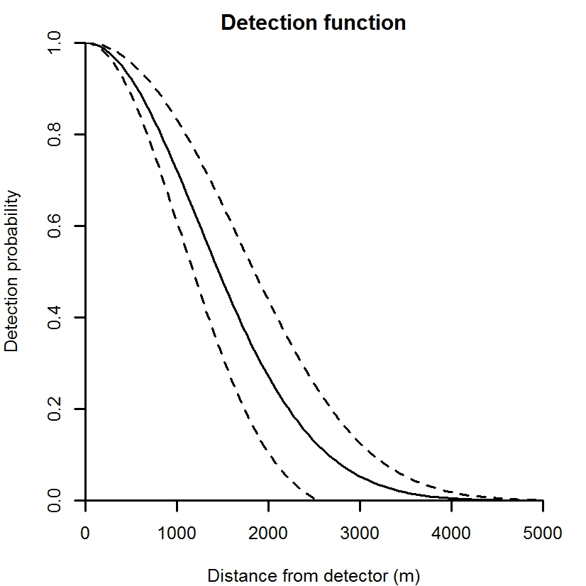
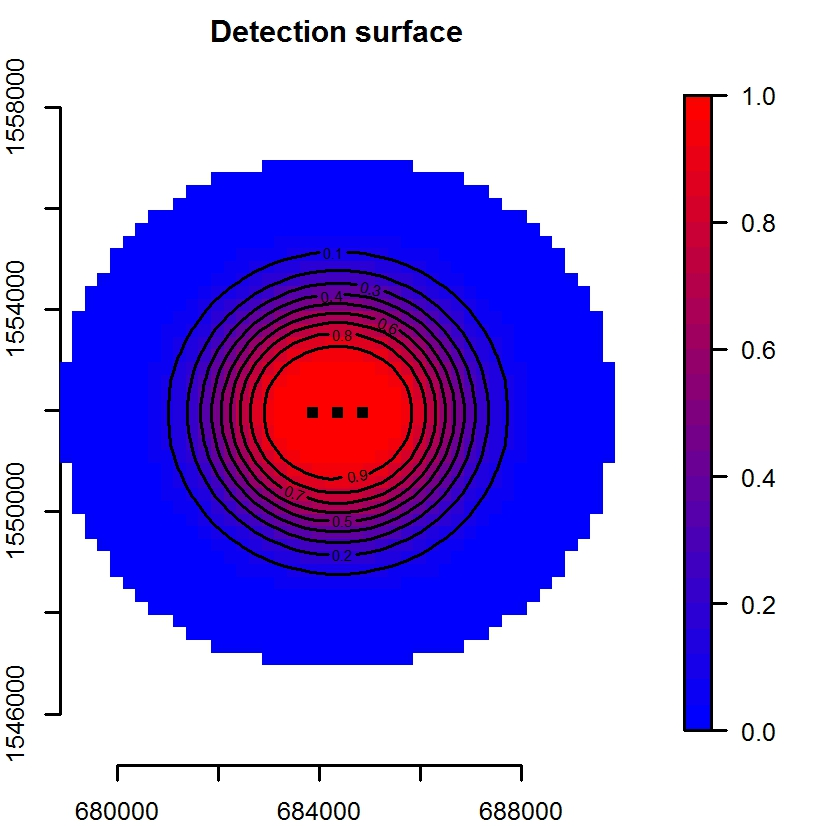
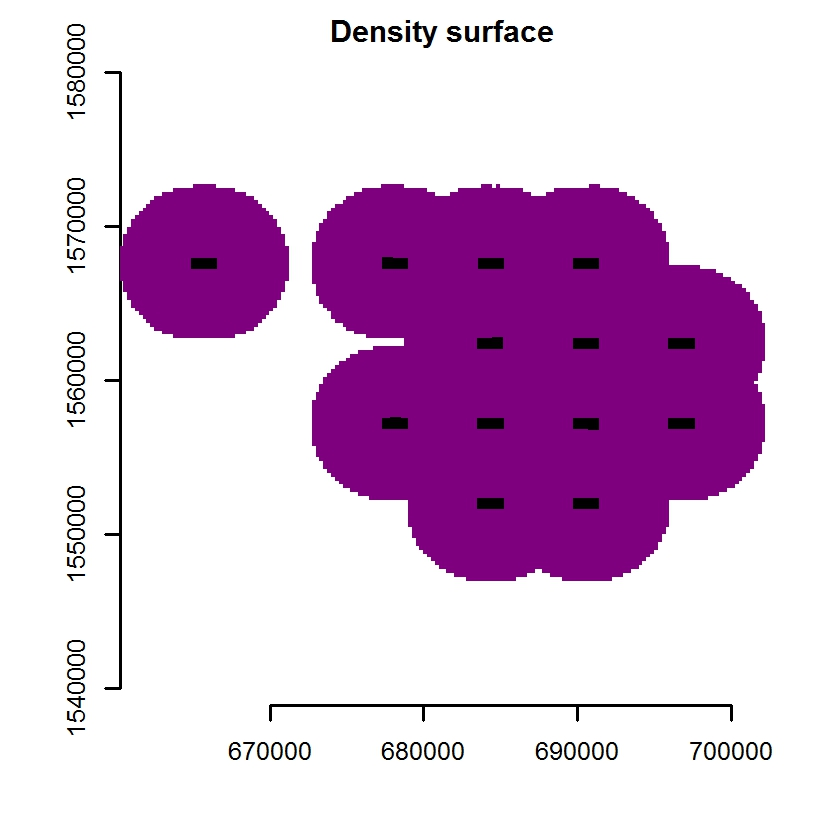
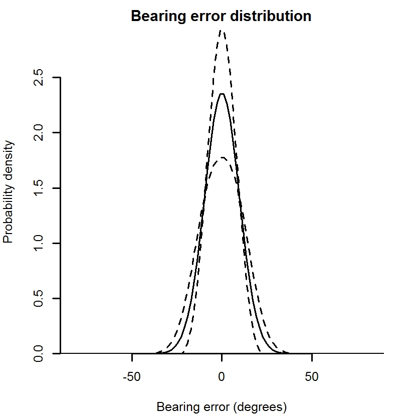

<a href="#plots">(Back to top of section)</a>  
<a href="#contents">(Back to contents)</a>


********************************************************************************

<a name="selection"></a>

## 8. Model selection

<a href="#selection-aic">**8.1 AIC**</a>  

<a href="#selection-aic">**8.2 Model plausibility**</a>  

<br>
An important element of statistical modelling is choosing a preferred model from a number of candidate models. For example, you may get a slightly different density estimate when using the hazard rate detection function instead of the half normal detection function. How do you decide which model, and therefore which density estimate, should be preferred?

<a name="selection-aic"></a>

### 8.1 AIC

A common way of choosing between competing models is to use something called the **AIC score**. This is a number that can be calculated from the fitted model which tries to measure how well the model balances having a good fit to the data whilst not being overly complex. The AIC score can be found at the bottom of the model summary printout (which is displayed after pressing the model *Summary* button at the bottom of the *Model* tab).

When using AIC it is important to bear in mind the following points:

* **Lower AIC scores are preferred.** For example, if model A has an AIC score of 10, and model B has a score of 100, then model A would be preferred to model B.

* **Negative scores are preferred to postitive scores.** For example, if model A has an AIC score of -10 and model B has a score of -100, then model B would be preferred to model A.

* **Diffences of 2 or more are meaningful.** This is a general rule-of-thumb for deciding between models with different number of coefficients. If the difference is less than this then you should be conservative and keep the model with the fewest coefficients. For example suppose you fitted model A with an intercept-only formula for density (i.e. no covariates) which had an AIC of 100. Then suppose you fitted a model B with habitat as a covariate for density (e.g. `D ~ habitat`) which had an AIC of 99. The difference is only -1 which isn't a big difference, and according to the rule of thumb the difference isn't large enough to prefer model B over model A. Now imagine that you fitted a third model, model C, using altitude as a covariate for density (e.g. `D ~ altitude`) which had an AIC of 95. The difference between model A and model C is 5, so according to the rule of thumb model C would be preferred.

* **Only models fitted to the same data can be compared using AIC.** For example, you could use AIC to help you decide whether or not to use the von Mises distribution or the Wrapped Cauchy distribution to model the bearing errors, because both models would have been fitted using the estimated bearings data. However you could *not* use AIC to compare two models where one used a bearing error distribution and one used no bearing error distribution, since the estimated bearings data would be used in the first model but ignored in the second models (the precision of the density estimate might be a better to make a decision in this case). For a similar reason, you also should *not* use AIC to compare models fitted using different masks. 

* **The magnitude of the AIC score tells you nothing about how *good* a model is.** The difference in AIC between two competing models helps you decide which one is better, but they might both be poor models. Unfortunatley on of the disadvantages of SECR is that there is currently no means for calculating model goodness-of-fit statistics.

<a href="#selection">(Back to top of section)</a>  
<a href="#contents">(Back to contents)</a>

<a name="selection-plausibility"></a>

### 8.2 Model plausibility

Whilst AIC can be extremely useful it shouldn't be used blindly and you should also ensure that any preferred model is also *plausible*. For example, model A might have a lower AIC score than model B, but if model A looks entirely unrealistic (e.g. given your knowledge of the study system) then you should discard it. For example, a fitted bearing error distribution which implied that errors as large as 180 degrees were highly probable might be ignored if such an outcome is known to be very unlikely under normal field conditions.

<br/>
<a href="#selection">(Back to top of section)</a>  
<a href="#contents">(Back to contents)</a>


********************************************************************************

<a name="menu"></a>

## 9. Menu Options

<a href="#menu-help">**9.1 The Help menu**</a>  
<a href="#menu-help-examples"> --- 9.1.1 Example Data</a>  

<a href="#menu-workspace">**9.2 The Workspace menu**</a>  
<a href="#menu-workspace-wd">  --- 9.2.1 Setting the working directory</a>  
<a href="#menu-workspace-save">--- 9.2.2 Saving and loading workspaces</a>  

<a href="#contents">(Back to contents)</a>

<a name="menu-help"></a>

### 9.1 The Help menu

<a name="menu-help-examples"></a>

#### 9.1.1 Example Data

This contains a link to data from a single-day survey of *Nomascus annamensis*. Clicking the link should automatically load this data into the interface. It might be a good idea to explore this data first and have a quick practice at fitting models before importing you own data.

<a href="#menu">(Back to top of section)</a>  
<a href="#contents">(Back to contents)</a>

<a name="menu-workspace"></a>

### 9.2 The Workspace menu

<a name="menu-workspace-wd"></a>

#### 9.2.1 Setting the working directory

This option allows you to specify a home directory for your project. Once it has been set, this will be the default directory when browsing for files and saving workspaces.

<a name="menu-workspace-save"></a>

#### 9.2.2 Saving and loading workspaces

These options allows you to save the current session, including the mask and model, and re-load it for later use. E.g. it may take a while to make a high resolution mask (especially if you import gis shapefiles) or fit a model with several covariates and saving the workspace means you won't have to repeat those steps every time you re-open the software. Bear in mind that if you want to save a series of models you should save them in separate workspaces (since each workspace contains a maximum of one fitted model).


********************************************************************************

<a name="bugs"></a>

## 10. Reporting bugs

Version 1.0 of the software is the first release version. Whilst it has been tested on a number of data sets there might still be some bugs or other things that need to be fixed. If you encounter anything that needs to be fixed, or if you have any other suggestions or feedback about the software, please email Darren at darrenkidney@yahoo.co.uk.

<br/>
<a href="#menu">(Back to top of section)</a>  
<a href="#contents">(Back to contents)</a>


********************************************************************************


